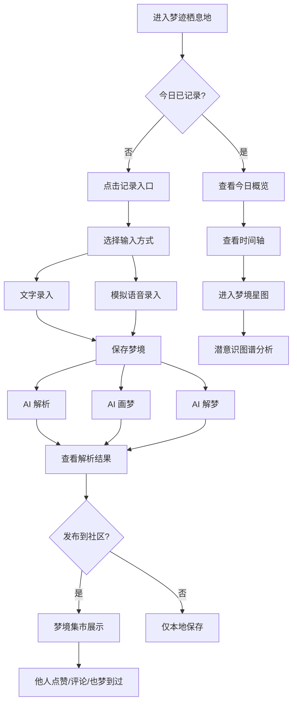

# 梦迹 DreamTrace - 产品需求文档 (PRD)

## 1. 产品概述
梦迹 DreamTrace 是一款梦幻风格的梦境记录与社区分享 Web 应用，帮助用户捕捉每日梦境、通过 AI 解析潜意识、可视化梦境场景，并与同好建立连接。
- **目标用户**：对梦境探索、自我觉察、潜意识分析感兴趣的年轻用户；有日记/冥想习惯的内容创作者
- **市场价值**：填补"梦境数字化 + AI 解析 + 社区共鸣"的空白，打造沉浸式梦境栖息地

## 2. 核心功能

### 2.1 用户角色
| 角色 | 注册方式 | 核心权限 |
|------|----------|----------|
| 梦境旅人 | 本地账号（昵称+头像）| 记录、解析、画梦、统计、发布到社区 |
| 访客 | 无需注册 | 浏览社区、点赞、标记"也梦到过" |

### 2.2 功能模块
1. **梦境栖息地（首页）**：星空首屏、今日梦境入口、近期梦境时间轴、限时梦境卡片
2. **梦境记录（记录页）**：文字输入 / 模拟语音输入、AI 解析（主题/意象/情绪）、AI 画梦、AI 解梦
3. **梦境星图（日历页）**：月历标记、时间轴回溯、历史梦境检索
4. **潜意识图谱（统计页）**：高频意象、人物出现频率、情绪色彩分布、梦境长度趋势
5. **梦境集市（社区页）**：梦境流、点赞、评论、"也梦到过"标记、分类筛选
6. **梦境详情**：完整梦境文本、AI 画作、解析卡片、互动入口

### 2.3 页面详情
| 页面名称 | 模块名称 | 功能描述 |
|----------|----------|----------|
| 梦境栖息地 | 星空首屏 | 流动星云背景、品牌标题、核心入口按钮 |
| 梦境栖息地 | 今日梦境入口 | 当日未记录时引导卡片，已记录时展示今日概览 |
| 梦境栖息地 | 限时梦境卡 | 每日限时主题梦境入口，倒计时提示 |
| 梦境栖息地 | 近期时间轴 | 横向滚动卡片，展示最近 7 条梦境 |
| 梦境记录 | 文字录入区 | 多行文本框、字数统计、情绪预设标签 |
| 梦境记录 | 模拟语音 | 麦克风按钮，模拟录音波形动画，转写为占位文本 |
| 梦境记录 | AI 解析面板 | 主题解读、意象提取（标签云）、情绪雷达 |
| 梦境记录 | AI 画梦 | 调用 text-to-image API 生成梦境场景插画 |
| 梦境记录 | AI 解梦 | 现实关联分析、元素映射列表 |
| 梦境星图 | 月历视图 | 日历格子，有梦之日显示星点标记 |
| 梦境星图 | 时间轴流 | 选中日期展示当日梦境列表，纵向时间轴 |
| 潜意识图谱 | 意象词云 | 高频意象气泡图，按出现次数排序 |
| 潜意识图谱 | 人物频率 | 横向柱状图，展示梦中常出现的人物 |
| 潜意识图谱 | 情绪色彩 | 甜甜圈图，情绪类型占比 |
| 潜意识图谱 | 趋势曲线 | 折线图，近 30 天梦境字数趋势 |
| 梦境集市 | 梦境流卡片 | 瀑布流卡片，含封面、摘要、作者、互动数 |
| 梦境集市 | 互动栏 | 点赞、评论、也梦到过标记按钮 |
| 梦境集市 | 筛选器 | 按情绪、主题、时间筛选 |
| 梦境详情 | 梦境正文 | 完整文本、记录时间、情绪标签 |
| 梦境详情 | AI 画作展示 | 大图展示生成的梦境插画 |
| 梦境详情 | 解析卡片组 | 主题/意象/情绪/解梦 四张卡片 |

## 3. 核心流程

**主要用户流程**：用户进入栖息地 → 点击"记录今日梦境" → 选择文字/语音输入 → 保存梦境 → 触发 AI 解析与画梦 → 查看潜意识图谱 → 选择发布到社区 → 与他人互动。

## 4. 用户界面设计

### 4.1 设计风格
- **主色**：#7B68EE（中紫罗兰）、#9B8DF8（淡薰衣草）、#1A1033（深夜空背景）
- **辅色**：#E0AAFF（星辉紫）、#FFB4E1（梦境粉）、#6FE7DD（梦境青）
- **按钮风格**：玻璃拟态（glassmorphism）+ 渐变描边 + 微光晕，圆角 16px
- **字体**：标题使用 "Noto Serif SC"（衬线梦幻感），正文使用 "Noto Sans SC"
- **布局风格**：深色星空背景 + 卡片式分层 + 顶部固定导航
- **图标风格**：线性柔和图标，统一使用 lucide-react
- **动效**：微悬浮、柔和渐变过渡、星云流动、星点闪烁

### 4.2 页面设计概览
| 页面名称 | 模块名称 | UI 元素 |
|----------|----------|---------|
| 梦境栖息地 | 星空首屏 | 渐变星云背景、浮动星点、品牌字样、光晕按钮 |
| 梦境栖息地 | 今日梦境入口 | 玻璃拟态卡片、渐变描边、状态文字 |
| 梦境栖息地 | 限时梦境卡 | 倒计时数字、主题标签、光晕效果 |
| 梦境栖息地 | 近期时间轴 | 横向滚动、卡片悬浮、日期标记 |
| 梦境记录 | 文字录入区 | 透明底输入框、渐变焦点边框、字数计数 |
| 梦境记录 | 模拟语音 | 圆形麦克风按钮、录音波形、脉冲动画 |
| 梦境记录 | AI 解析面板 | 标签云、情绪雷达图、主题卡片 |
| 梦境记录 | AI 画梦 | 生成图片展示、加载动画、重新生成按钮 |
| 梦境星图 | 月历视图 | 星空格子、星点标记、选中高亮 |
| 潜意识图谱 | 意象词云 | 渐变气泡、大小区分频率 |
| 梦境集市 | 梦境流卡片 | 瀑布流布局、封面图、互动栏 |
| 梦境详情 | 解析卡片组 | 四宫格卡片、图标+文字 |

### 4.3 响应式
- 桌面端优先设计（1280px+）
- 平板端（768-1279px）：侧边栏收起为图标导航
- 移动端（<768px）：底部导航栏、单列布局、触控优化

### 4.4 动画与微交互
- 页面加载：星云渐显 + 元素错峰上浮
- 悬停效果：卡片微上浮 + 光晕增强 + 阴影加深
- 按钮点击：微缩放 + 涟漪扩散
- 滚动触发：视差星空背景、元素渐入
- 录音状态：麦克风脉冲 + 波形动画
