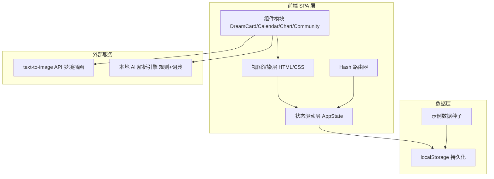
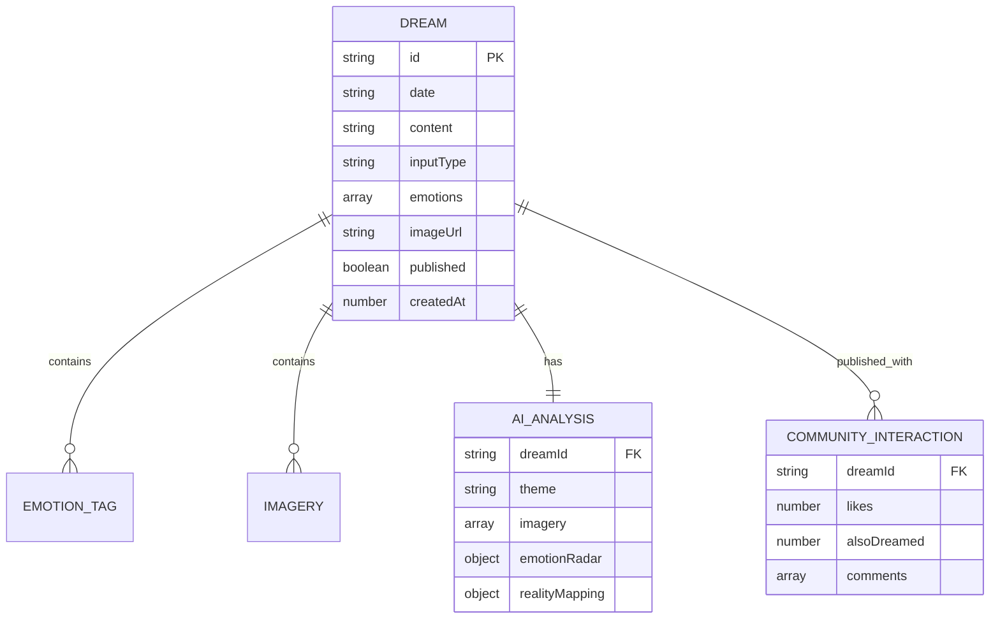

# 梦迹 DreamTrace - 技术架构文档

## 1. 架构设计



## 2. 技术说明
- **前端**：原生 HTML5 + CSS3 + JavaScript（ES6+），无框架，单页应用（SPA）
- **架构模式**：状态驱动 UI（AppState 单一数据源 → render 函数同步视图）
- **路由**：Hash 路由（#home / #record / #calendar / #stats / #community / #detail/:id）
- **存储**：localStorage，封装为 Store 模块提供 CRUD API
- **图表**：原生 Canvas + SVG 手绘（雷达图、词云、柱状图、甜甜圈图、折线图）
- **AI 引擎**：基于本地词典 + 规则的模拟解析（主题分类、意象提取、情绪评分、现实映射）
- **图片生成**：调用 `https://trae-api-cn.mchost.guru/api/ide/v1/text_to_image?prompt={prompt}&image_size={image_size}` 生成梦境插画
- **字体**：Noto Serif SC（标题）、Noto Sans SC（正文），通过 Google Fonts 引入

## 3. 路由定义
| 路由 | 用途 |
|------|------|
| `#home` | 梦境栖息地首页：星空首屏 + 今日入口 + 时间轴 |
| `#record` | 梦境记录页：文字/语音录入 + AI 解析 + 画梦 + 解梦 |
| `#calendar` | 梦境星图：月历视图 + 时间轴回溯 |
| `#stats` | 潜意识图谱：意象词云 + 人物频率 + 情绪色彩 + 趋势曲线 |
| `#community` | 梦境集市：瀑布流卡片 + 互动 + 筛选 |
| `#detail/:id` | 梦境详情：正文 + 画作 + 解析卡片 |

## 4. 文件结构
```
trae_app11/
├── index.html              # 单页应用入口
├── styles/
│   ├── base.css            # 变量、重置、字体、通用工具
│   ├── layout.css          # 导航、容器、栅格
│   ├── components.css      # 卡片、按钮、表单、标签
│   ├── pages.css           # 各页面专属样式
│   └── animations.css      # 粒子、星光、过渡动画
├── scripts/
│   ├── app.js              # 入口：路由 + 状态初始化
│   ├── store.js            # localStorage CRUD 封装
│   ├── router.js           # Hash 路由器
│   ├── state.js            # AppState 单例 + 订阅
│   ├── ai-engine.js        # AI 解析引擎（主题/意象/情绪/解梦）
│   ├── image-api.js        # 文生图 API 封装
│   ├── charts.js           # Canvas 图表绘制
│   ├── components.js       # 可复用组件渲染函数
│   ├── pages/
│   │   ├── home.js
│   │   ├── record.js
│   │   ├── calendar.js
│   │   ├── stats.js
│   │   ├── community.js
│   │   └── detail.js
│   └── seed-data.js        # 示例梦境种子数据
└── .trae/documents/        # PRD 与技术文档
```

## 5. 数据模型

### 5.1 数据模型定义


### 5.2 数据定义语言（localStorage Schema）
```javascript
// 梦境对象
{
  id: "dream_1700000000000",
  date: "2026-07-01",
  content: "我梦见自己在一片紫色的海洋中漂浮...",
  inputType: "text" | "voice",
  emotions: ["宁静", "神秘"],
  imageUrl: "https://...",
  published: false,
  createdAt: 1700000000000,
  analysis: {
    theme: "漂浮与释放",
    imagery: ["海洋", "紫色", "漂浮"],
    emotionRadar: { 宁静: 0.8, 神秘: 0.6, 喜悦: 0.4, 恐惧: 0.1, 悲伤: 0.0, 愤怒: 0.0 },
    realityMapping: [
      { element: "海洋", meaning: "近期情绪波动较大，渴望释放压力" },
      { element: "紫色", meaning: "对精神性探索的向往" }
    ]
  },
  community: {
    likes: 0,
    alsoDreamed: 0,
    comments: []
  }
}
```

## 6. AI 引擎设计

### 6.1 主题分类词典
- **漂浮类**：飞、飘、浮、海洋、天空、云
- **追逐类**：追、跑、逃、坠落、迷宫
- **相遇类**：见面、对话、拥抱、重逢
- **迷失类**：找不到、迷路、黑暗、空旷
- **转化类**：变形、变身、魔法、超能力

### 6.2 意象提取规则
- 名词词典匹配 + 频次统计
- 主题相关意象加权
- 返回 Top 5 高频意象

### 6.3 情绪雷达
- 6 维度：宁静、神秘、喜悦、恐惧、悲伤、愤怒
- 基于关键词权重打分（0-1）
- 归一化后绘制雷达图

### 6.4 现实映射库
- 预置 30+ 常见梦境元素 → 现实含义映射
- 未命中时返回通用解读模板

## 7. 性能与体验
- 首屏 CSS 内联关键样式，JS 异步加载
- 图表使用 requestAnimationFrame 平滑绘制
- 图片懒加载 + 占位骨架
- 路由切换淡入淡出过渡
- localStorage 写入防抖（300ms）
