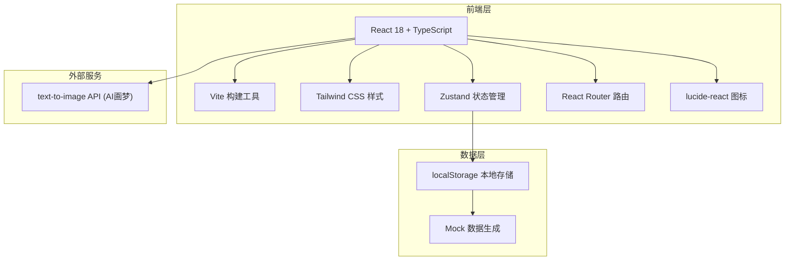
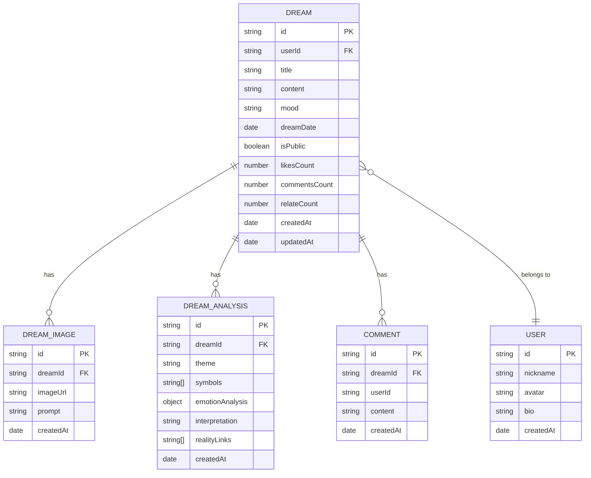

# 梦迹 DreamTrace - 技术架构文档

## 1. 架构设计



## 2. 技术描述
- **前端框架**：React 18 + TypeScript
- **构建工具**：Vite 5
- **样式方案**：Tailwind CSS 3
- **状态管理**：Zustand
- **路由方案**：React Router DOM 6
- **图标库**：lucide-react
- **后端**：无（纯前端 SPA，数据本地存储）
- **数据库**：localStorage + 内存 mock 数据
- **图片生成**：text-to-image API（通过前端直接调用）

## 3. 路由定义
| 路由路径 | 页面名称 | 用途 |
|----------|----------|------|
| `/` | 梦境栖息地（首页） | 星空首屏、今日梦境入口、近期梦境、限时梦境 |
| `/record` | 梦境记录页 | 文字/语音录入、AI解析、AI画梦、AI解梦 |
| `/calendar` | 梦境星图页 | 月历视图、时间轴回溯、历史梦境 |
| `/insights` | 潜意识图谱页 | 意象词云、人物频率、情绪色彩、趋势曲线 |
| `/community` | 梦境集市页 | 社区梦境流、互动、筛选 |
| `/dream/:id` | 梦境详情页 | 完整梦境内容、AI画作、解析卡片 |

## 4. 数据模型

### 4.1 数据模型定义



### 4.2 数据存储结构

```typescript
interface User {
  id: string;
  nickname: string;
  avatar: string;
  bio: string;
  createdAt: string;
}

interface Dream {
  id: string;
  userId: string;
  title: string;
  content: string;
  mood: 'joyful' | 'peaceful' | 'anxious' | 'sad' | 'excited' | 'confused' | 'neutral';
  dreamDate: string;
  isPublic: boolean;
  likesCount: number;
  commentsCount: number;
  relateCount: number;
  likedByMe: boolean;
  relatedByMe: boolean;
  images: DreamImage[];
  analysis: DreamAnalysis | null;
  createdAt: string;
  updatedAt: string;
}

interface DreamImage {
  id: string;
  imageUrl: string;
  prompt: string;
  createdAt: string;
}

interface DreamAnalysis {
  theme: string;
  themeDescription: string;
  symbols: Array<{ name: string; meaning: string; frequency: number }>;
  emotions: Array<{ name: string; level: number; color: string }>;
  interpretation: string;
  realityLinks: Array<{ element: string; realityMapping: string; confidence: number }>;
}

interface Comment {
  id: string;
  dreamId: string;
  userId: string;
  nickname: string;
  avatar: string;
  content: string;
  createdAt: string;
}

interface DailyDreamChallenge {
  id: string;
  date: string;
  theme: string;
  description: string;
  emoji: string;
}
```

## 5. 目录结构

```
src/
├── components/          # 通用组件
│   ├── layout/         # 布局组件
│   │   ├── Navbar.tsx
│   │   ├── Sidebar.tsx
│   │   └── StarryBackground.tsx
│   ├── ui/             # UI 基础组件
│   │   ├── GlassCard.tsx
│   │   ├── GlowButton.tsx
│   │   └── DreamTag.tsx
│   └── dream/          # 梦境相关组件
│       ├── DreamCard.tsx
│       ├── DreamAnalysisCard.tsx
│       └── CommentSection.tsx
├── pages/              # 页面组件
│   ├── Home.tsx        # 梦境栖息地
│   ├── Record.tsx      # 梦境记录
│   ├── Calendar.tsx    # 梦境星图
│   ├── Insights.tsx    # 潜意识图谱
│   ├── Community.tsx   # 梦境集市
│   └── DreamDetail.tsx # 梦境详情
├── store/              # 状态管理
│   ├── useDreamStore.ts
│   └── useUserStore.ts
├── utils/              # 工具函数
│   ├── mockData.ts
│   ├── dateUtils.ts
│   ├── aiAnalysis.ts
│   └── imageGenerator.ts
├── types/              # 类型定义
│   └── index.ts
├── App.tsx
├── main.tsx
└── index.css
```

## 6. 核心技术决策

### 6.1 状态管理策略
- 使用 Zustand 管理全局状态（梦境列表、用户信息、UI 状态）
- 持久化存储：通过 zustand/middleware 的 persist 中间件同步到 localStorage
- 组件级状态使用 React useState/useReducer

### 6.2 样式策略
- Tailwind CSS + 自定义主题色变量
- 玻璃拟态效果通过 backdrop-blur + 半透明背景实现
- 渐变和光晕效果使用 CSS 自定义属性统一管理
- 动画使用 CSS transitions + keyframes

### 6.3 AI 功能模拟方案
- AI 解析：使用本地算法 + 预设模板模拟解析结果
- AI 画梦：调用 text-to-image API 生成图片，失败时使用占位图
- AI 解梦：基于关键词匹配 + 预设解梦库生成分析

### 6.4 性能优化
- 图片懒加载
- 虚拟滚动（长列表）
- 组件按需渲染
- 星空背景使用 Canvas 或 CSS 动画优化
